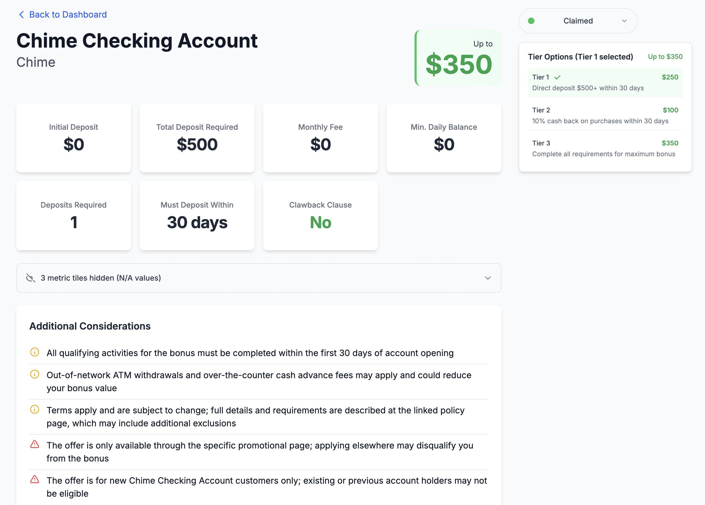

# ChurnChurnChurn

This project is a Flask application for tracking and planning bank account churning offers.

## Features

- Track bank account offers from URLs or manual content input
- AI-powered content analysis using OpenAI and Google Gemini
- Plan account opening strategies based on pay cycles
- Secure API key management
- Web-based interface for easy management

## About The Project

"Bank account churning" is the practice of opening new bank accounts to take advantage of promotional offers and sign-up bonuses. While it can be a great way to earn extra money, it can be challenging to keep track of different offers, their requirements (like minimum deposits or direct deposit setups), and important dates.

That's where ChurnChurnChurn comes in. This tool is designed to be your personal assistant for bank account churning. It helps you:

- **Discover and Track Offers:** Easily save and organize bank account offers you find online
- **Understand the Fine Print:** Our AI-powered analysis extracts key details from offer descriptions, so you know exactly what you need to do to qualify for a bonus
- **Plan Your Strategy:** The planning feature helps you schedule account openings and actions around your pay cycles to meet direct deposit requirements efficiently
- **Stay Organized:** Keep all your churning activities in one place, so you never miss a deadline or a bonus 

Whether you're new to churning or a seasoned pro, ChurnChurnChurn helps you maximize your rewards and minimize the hassle.

Check out [Doctor of Credit](https://www.doctorofcredit.com/best-bank-account-bonuses/) for a great resource on ongoing bonuses and bypassing direct deposit requirements.

<p align="center">
  
  <br>
  <em>A view of a single tracked offer.</em>
</p>

## Quick Start

**Prerequisites:** Python 3.8+

### 1. Installation & Running

Getting started is as simple as 1, 2, ... oh.. that's it I guess!

1.  **Download and extract** the [latest release ZIP file](https://github.com/sacrosaunt/ChurnChurnChurn/releases)
2.  **Run the launcher:** You can run the commands below in your terminal, or simply **double-click the `churn` file** (`churn.bat` on Windows)

    -  On **macOS/Linux**:
        ```sh
        ./churn
        ```
    -   On **Windows**:
        ```cmd
        churn.bat
        ```

When you run the launcher for the first time, it will automatically:
- Create an isolated virtual environment (`.venv`)
- Install all the necessary dependencies
- Start the application

On subsequent runs, it will just start the application directly.

The application will automatically open in a new browser tab at `http://127.0.0.1:5000`.

### 2. API Key Setup

On the first run, you will be redirected to a setup page to enter your API keys.

You need to provide at least one key (either OpenAI or Gemini) to use the application.


## License

This project is licensed under the MIT License - see the [LICENSE](LICENSE) file for details.
